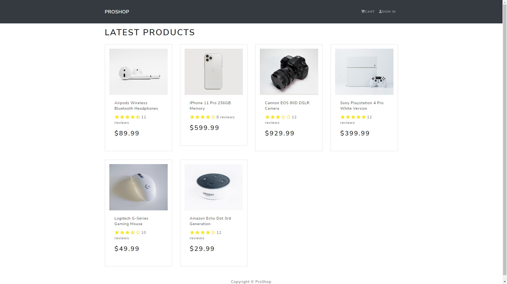

**This is the Frontend of the Application.**



# How to build this project locally?

Clone this repo using the below code.

```
git clone https://github.com/Codeminant/E-Commerce-App.git
```

Change the PWD to ProShop/frontend and run the command below

```
npm install
```

Run below command to locally run the frontend in browser.

```
npm start
```

Run the following command to install the packages. (PWD to ProShop/frontend)

```
npm i react-router-dom@5.3.0 react-router-bootstrap@0.25.0
```
